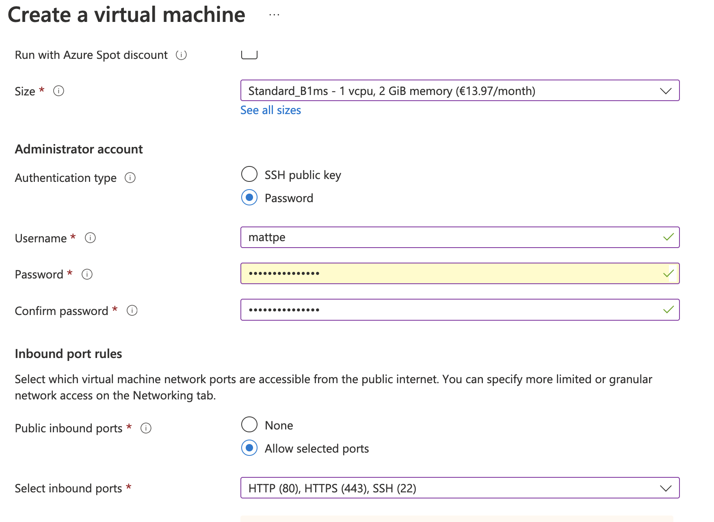

# Media Distribution and Data Streams 1

## Materials & links

Browse, read, watch & study:


- [Introduction to Azure fundamentals](https://learn.microsoft.com/en-us/training/modules/intro-to-azure-fundamentals/)
- [Get started with Azure](https://azure.microsoft.com/en-us/get-started/)
- [MS Azure Youtube channel](https://www.youtube.com/channel/UC0m-80FnNY2Qb7obvTL_2fA)
- [Azure portal](https://portal.azure.com/)
- [Azure CLI](https://docs.microsoft.com/en-us/cli/azure/)
- [Azure network security group](https://docs.microsoft.com/en-us/azure/virtual-network/network-security-groups-overview)

Help for Linux usage:

- [Using Linux command line](https://ubuntu.com/tutorials/command-line-for-beginners)
- [The Beginner’s Guide to Nano, the Linux Command-Line Text Editor](https://www.howtogeek.com/howto/42980/the-beginners-guide-to-nano-the-linux-command-line-text-editor/)
- [Ubuntu package management](https://ubuntu.com/server/docs/package-management)
- [Ubuntu firewall](https://ubuntu.com/server/docs/security-firewall)

## Getting started & setting up the environment

1. Sign up for a free [student account](https://azure.microsoft.com/en-us/free/students/) using your school email address & login, you should get some free credits (100 USD), [more info](https://docs.microsoft.com/en-us/azure/education-hub/azure-dev-tools-teaching/program-faq)
1. Go to [Azure portal](https://portal.azure.com/)
1. Create a resource: Virtual machine (VM), use server instance, e.g. latest Ubuntu server LTS)

   - select [VM size](https://docs.microsoft.com/en-us/azure/virtual-machines/sizes) & disks according your needs (Think about what is the minimum for a web server? Check the OS system requirements, etc.)
   - 'Standard_B1ms' is the teacher's recommendation for this course
   - NOTE: you have 100 USD of student credits to spend in total (for a one year)
   - Allow access to SSH, HTTP and HTTPS ports

   

   - Finally hit the _CREATE_ button and after successful deployment of the virtual machine go to the resources's _Overview_ page and configure the _DNS name_.
   - Note: VM is paid by hour when the VM is running. In development use it's a good idea to stop the VM when you don't need it (start/stop buttons are found in Azure portal).

1. Use SSH connection for managing your VM (`ssh username@PUBLIC_IP/YOUR_DOMAIN_NAME` in terminal/git bash or use e.g. [Putty](https://www.putty.org/))

   - Optional: use public key authentication instead of username/password: [Instructions](https://www.digitalocean.com/community/tutorials/how-to-set-up-ssh-keys-on-ubuntu-22-04)

1. Make sure you have all recent updates installed (this should be done on weekly basis)

   ```bash
   sudo apt update # checks for available updates
   sudo apt dist-upgrade # installs updates including kernel packages
   ```

   All administrator level tasks needs superuser (root) privileges. `sudo` (_superuser do_) needs to used before the actual command for gaining the access rights. Use your login password if prompted.

## Installing & configuring web server software

### Apache web server

1. Install

   ```sh
   sudo apt update
   sudo apt upgrade
   sudo apt install apache2
   ```

1. Check configuration files `/etc/apache2/` & start `sudo systemctl start apache2`
1. Add write permissions to your user account for the webroot folder `/var/www/html`: `sudo chown <MYUSERNAME>.<GROUP> /var/www/html`
1. Copy your UI files to the webroot using e.g. scp/filezilla/winscp or clone/pull from GitHub
1. Add a "physical" firewall resource or use the already created Network Security Group resource
1. Check/fix software firewall status & rules on Linux (e.g. limit ssh access)
1. Test with a browser that your web server works and is accessible from internet (http://<yourwebsite.hostname>.cloudapp.azure.com/)

### Assignment 1 - Requirements

Virtual environment in Azure containing:

- A virtual server running Linux operating system (Latest Ubuntu LTS distribution preferred)
  - hardware & other specs must meet the needs, explain your choices
  - what is the calculated price, think about the cost-effectiveness
- SSH access to server
- Running web server (Apache of Nginx) on server
  - some sample page accessible from internet
- Firewall with correct rules (physical/software)

Returning: Short report including a network diagram & screen shots of your environment. Check assignment in OMA.  
Grading: max 4 points
