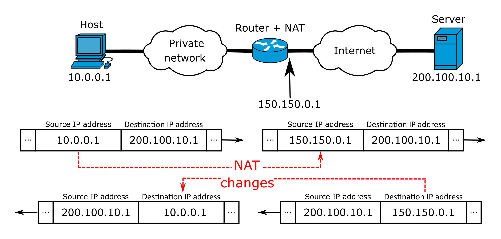

# Media Distribution and Data Streams 2

IP network recap.

## Internet Protocol (IP)

- a protocol used for routing and addressing packets of data in computer network
- based on IP addresses
- static or dynamic address assignment

### IPv4

- 32-bit address space, 4,294,967,296 (2^32) unique addresses
- special addresses reserved for [special use](https://en.wikipedia.org/wiki/IPv4#Special-use_addresses) and [private networks](https://en.wikipedia.org/wiki/Private_network)
- [Network address translation (NAT)](https://en.wikipedia.org/wiki/Network_address_translation) for mapping addresses between private & public networks

  

Basic configuration example in older Ubuntu systems (`/etc/network/interfaces`):

```conf
# The primary network interface
auto eth0
iface eth0 inet static
address 192.168.2.33
gateway 192.168.2.1
netmask 255.255.255.0
network 192.168.2.0
broadcast 192.168.2.255
```

[Configuring networks Ubuntu documentation](https://ubuntu.com/server/docs/network-configuration)

One online tool for calculating subnets & netmasks: [IP Subnet Calculator](https://www.calculator.net/ip-subnet-calculator.html)

### [IPv6](https://en.wikipedia.org/wiki/IPv6)

- most recent version (since 1998 :)
- 128-bit address, approximately 3.4×10^38 addresses
  - hexadecimal format (base 16) e.g. `2a00:1190:0001:0002:0003:0000:0000:ffff` or shortened `2a00:1190:1:2:3::ffff`
- still coming, needs device support, check [current adoption](https://www.google.com/intl/en/ipv6/statistics.html)

## OSI vs. TCP/IP Model


[source](https://www.researchgate.net/figure/The-logical-mapping-between-OSI-basic-reference-model-and-the-TCP-IP-stack_fig2_327483011)

## Transmission Control Protocol (TCP)

- error checking, guaranteed delivery of data
- retransmission of lost packets
- reliable
- HTTP, web pages, still images, etc.

## User Datagram Protocol (UDP)

- no retransmission of lost packets
- faster than tcp, more real-time
- better for streaming and video conferencing where low latency matters

## Ports

- Communication endoint that identifies a network service (destination port)
- [Common port numbers](https://en.wikipedia.org/wiki/Port_(computer_networking)#Common_port_numbers) for well-known services/protocols
- 16-bit unsigned integer (0-65535)
- number can be included in URL, e.g. `http://www.example.com:3000/`
- source ports are generated randomly

## Streaming Protocols

Study: [Streaming Protocols: Everything You Need to Know by Traci Ruether/Wowza](https://www.wowza.com/blog/streaming-protocols)

## Assignment 2

### A. Azure setup continues

1. Setup [a SSL certificate](https://www.kaspersky.com/resource-center/definitions/what-is-a-ssl-certificate) for your Web server.
    - [Let’s Encrypt is a free, automated, and open certificate authority (CA)](https://letsencrypt.org/about/)
    - Use [Certbot](https://certbot.eff.org/) for easy installation
2. Setup [SSH authentication](https://docs.github.com/en/authentication/connecting-to-github-with-ssh) between your server and your Github account for deploying your web app.
    -  Create a Github repo and push your test web site code to Github
    -  Clone/pull code from Github to your server.
    -  Copy your public html files to server's web root: `cp -Rv my-web-app/* /var/www/html/` 
3. Setup network security (if not done yet):
    - Check your home network's external IP (Google "what's my ip")
    - Check school network's external IP
    - Study what's the [difference between Azure FW and NSG](https://searchcloudcomputing.techtarget.com/answer/Compare-Azure-Firewall-vs-NSGs-for-network-security)
    - Setup firewall rules
      - calculate correct network (Tip: Use IP subnet calculator)

(max 1 point)

### B. Write a report

Check questions and returning instructions in Oma. (max. 3 points)
