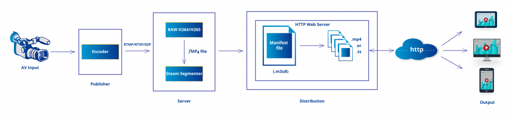
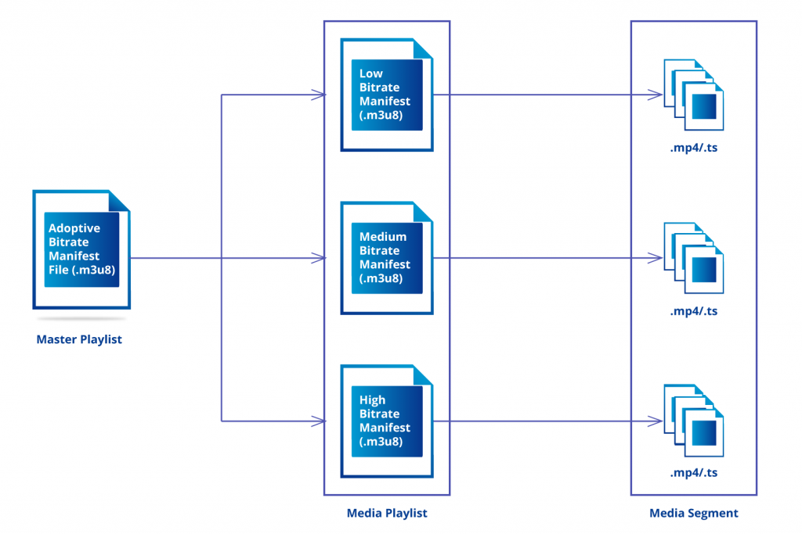

# Media Distribution and Data Streams 4

## HTTP Live Streaming, HLS

- adaptive bitrate streaming technique
- splits content to smaller chunks
- served over HTTP
  - no complicated port configs, easier to pass firewalls
- uses conventional Web server like Apache or Nginx
- wide client support
- developed by Apple

  

- manifest files are used to instruct the client how to get the correct quality version of the content

  
([src](https://www.synopi.com/hls-http-live-streaming))

## Dynamic Adaptive Streaming over HTTP, (MPEG-)DASH

- adaptive bitrate streaming technique
- splits content to smaller chunks
- served over HTTP
  - no complicated port configs, easier to pass firewalls
- uses conventional Web server like Apache or Nginx
- wide client support
- developed under MPEG alliance (Moving Picture Experts Group)
- manifest files are used to instruct the client how to get the correct quality version of the content

---

Reading: [HLS vs. MPEG-DASH](https://www.dacast.com/blog/mpeg-dash-vs-hls-what-you-should-know/)

## Web Real-Time Communications, WebRTC

[MDN Web docs: WebRTC API](https://developer.mozilla.org/en-US/docs/Web/API/WebRTC_API)

- HTML5 specification (JavaScript)
- Peer-to-peer API/solution for exchanging data (incl. audio & video) between browsers
- free and open source technology originally by Google
- supported by modern browser on mobile devices too
- connection between two devices is established through a discovery and negotiation process called signaling and requires the use of a signaling server
- main components (JavaScript APIs):
  - `getUserMedia`: e.g. for accessing device's camera and microphone
  - `RTCPeerConnection`: handling audio and video communication between peers
  - `RTCDataChannel`: bidirectional communication of arbitrary data between peers, uses the same API as WebSockets and has very low latency
  - `RTCSessionDescription`: describes one end of a connection and how it’s configured
  - `getStats`: retrieve a set of statistics about WebRTC sessions

## Assignment 4

### Part A. Simple _adaptive_ HTTP stream distribution

Check: [MDN Setting up adaptive streaming media sources](https://developer.mozilla.org/en-US/docs/Web/Guide/Audio_and_video_delivery/Setting_up_adaptive_streaming_media_sources)

Choose DASH or HSL.

1. Create a HD quality video file for the public stream
1. Use e.g. [ffmpeg](https://ffmpeg.org/) tool to encode video files and to the generate manifest file
    - (available via apt package manager in Ubuntu: `apt install ffmpeg`)
    - NOTE: transcoding video files needs CPU power -> using your local computer for transcoding is preferred
    - DASH example in [MDN web docs](https://developer.mozilla.org/en-US/docs/Web/Media/DASH_Adaptive_Streaming_for_HTML_5_Video)
    - available for Mac via [Homebrew](https://formulae.brew.sh/formula/ffmpeg)
    - One Youtube tutorial for Windows: [How To: Download+Install FFMPEG on Windows 10 | 2021](https://www.youtube.com/watch?v=r1AtmY-RMyQ)
    - [HLS example](https://ottverse.com/hls-packaging-using-ffmpeg-live-vod/)
1. Upload video and manifest files to the web server
1. Create a simple webpage including `<video>` element for serving and playing the video (see sample html below)
1. Publish & test on your server in Azure environment
    - Use Apache webroot (e.g. `/var/www/`) and update Apache configuration (located most likely in `/etc/apache2/sites-available/000-default-le-ssl.conf` file) for correct webroot (it's ok to disable reverse proxy totally for this task)
    - use Chrome dev tools to [simulate](https://www.browserstack.com/guide/how-to-perform-network-throttling-in-chrome) poor connection and make sure that video quality drops accordingly

Sample html page for the player:

```html
<!DOCTYPE html>
<html lang="en">
<head>
  <meta charset="UTF-8">
  <meta name="viewport" content="width=device-width, initial-scale=1.0">
  <script src="https://cdn.dashjs.org/latest/dash.all.min.js"></script>
  <title>My Example DASH Player</title>
    <style>video {width: 1280px; height: 720px;}</style>
</head>
<body>
  <video data-dashjs-player controls>
    <source src="my_video_manifest.mpd"  type="application/dash+xml">
    <!-- Fallback, enable after making sure that mpd file works, <source src="example-vid.mp4"> -->
    Your browser does not support the video tag.
  </video>
</body>
</html>
```

### Part B. WebRTC

Read: [Google code labs](https://codelabs.developers.google.com/codelabs/webrtc-web) and watch [WebRTC Tutorial | Video Chat App Using Native WebRTC API From Scratch](https://www.youtube.com/watch?v=JhyY8LdAQHU)

1. Follow one of the tutorials and create a WebRTC app
    - Remember [good coding practices](https://gist.github.com/mattpe/31fe23e372925cf13693a34bf09c92ad)
1. _Try_ to deploy your app to Azure environment
    - If you didn't succeed, describe what are the challenges/problems in your report
    - Some help (it's for Heroku but the idea can be adapted to Azure and other deployment platforms too): [How To Deploy a React Application to Heroku](https://www.youtube.com/watch?v=RQcWKcMa_Jc)

Returning: Short report including a written description and source code of your solution and screen shots displaying the working system. Check assignment in OMA.  

Grading: max. 4 points.

---

### Extras

Consider using [Web App](https://docs.microsoft.com/en-us/azure/app-service/?WT.mc_id=Portal-Microsoft_Azure_Marketplace) service for [hosting your Node.js application](https://docs.microsoft.com/en-us/azure/app-service/quickstart-nodejs?pivots=platform-linux) in Azure. More reading: [How To Run and Deploy React with NodeJS Backend on Azure App Services](https://medium.com/bb-tutorials-and-thoughts/how-to-run-and-deploy-react-with-nodejs-backend-on-azure-app-services-b853f6e5234f).

---

**OR:** If you want to run and serve multiple node.js apps on your server at the same time, it's possible to run them at different ports:

- update your Apache config to use separate url paths for different applications:

  ```conf
  #...clip

  # your-server-name.com/ points to static html files 
  DocumentRoot /var/www/html

  # your-server-name.com/chat -> node.js app on port 3000
  ProxyPass /chat http://localhost:3000/
  RewriteEngine on
  RewriteCond %{HTTP:Upgrade} websocket [NC]
  RewriteCond %{HTTP:Connection} upgrade [NC]
  RewriteRule ^/chat?(.*) "ws://localhost:3000/$1" [P,L]
  
  # your-server-name.com/other-app -> node.js app on port 3003
  ProxyPass /other-app http://localhost:3003/
  RewriteEngine on
  RewriteCond %{HTTP:Upgrade} websocket [NC]
  RewriteCond %{HTTP:Connection} upgrade [NC]
  RewriteRule ^/other-app?(.*) "ws://localhost:3003/$1" [P,L]
  
  #...clip

  ```

- then you need to fix your node.js apps to support subpath in URL: [Serving a Node.js Express App From a Subfolder](https://betterprogramming.pub/serving-a-node-js-express-app-from-a-subfolder-a-routing-lifehack-a3c88da9840c)

Other (and maybe) better solution for production use compared to using sub-folders would be using separate sub-domains for deployment of separate node.js applications: [Configuring a Subdomain in Apache2](https://codeburst.io/configuring-a-subdomain-in-apache2-f7a8b316b42c). Then you need to use Certbot to generate SSL certificates for the subdomains too. But at first you need to configure [Azure DNS](https://docs.microsoft.com/en-us/azure/dns/dns-zones-records) and add separate DNS records or a wildcard record for your new sub-domains to make them accessible.
